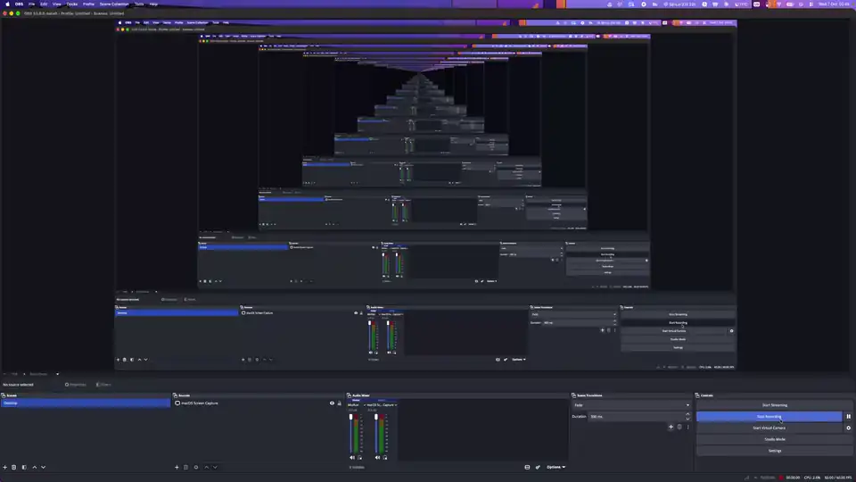
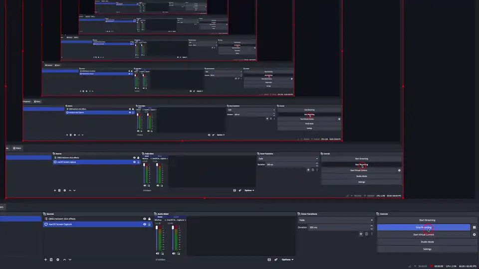
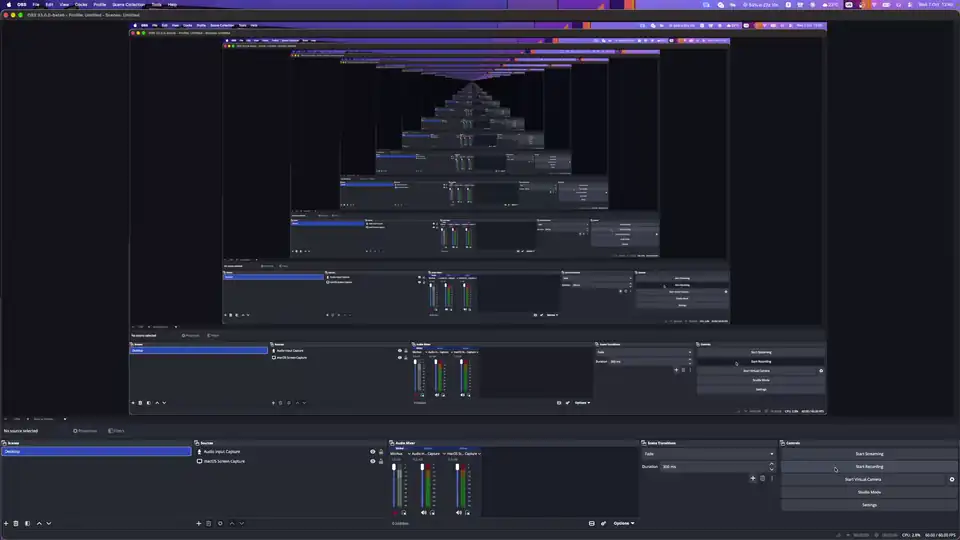

# OBSCineZoom

An OBS Studio Lua script that zooms a display capture and follows your mouse, with smooth
spring motion and optional auto-zoom on clicks, in the spirit of Screen Studio.

<p align="center">
  <a href="https://github.com/raulpetruta/obs-cine-zoom/releases/latest/download/cinezoom.lua">
    
  </a>
</p>

> [!NOTE]
> **Built entirely with AI.** OBSCineZoom was "vibe coded": Claude Opus 5.5 planned it and
> Claude Sonnet 5.5 wrote the code, with me testing it in OBS and steering. It has a test suite,
> but no human has reviewed every line. Weigh that however you feel about AI-written software
> before you use it.

**Why this exists:** I wanted mouse-follow, auto-zoom, click ripples and click sounds directly
inside OBS, without installing a separate screen recorder. So I asked Claude to build it.

It started as a fork of [obs-zoom-to-mouse](https://github.com/BlankSourceCode/obs-zoom-to-mouse)
by BlankSourceCode and was restructured to work on macOS with OBS 30 and newer.
Big shout-out to [BlankSourceCode](https://github.com/BlankSourceCode): their original script did the hard groundwork this project is built on.

> **Status:** zoom, mouse follow, click sound, click ripple and the studio look are confirmed working on macOS
> (Apple Silicon, OBS 33 beta, macOS Screen Capture). Windows and Linux have not been tested on
> real OBS yet. If something is off, use the [macOS test checklist](#macos-test-checklist) and
> **Diagnose**, and report what you see.

## Demo

**Auto-zoom on click, with click ripple and click sound**: set up in the script panel, then
clicking zooms in and the view follows the mouse.



**Mouse follow**: zoomed in, the view smoothly tracks the cursor.



**Studio look**: one click puts your screen on a gradient, solid colour or image background with
padding, rounded corners and a drop shadow. Colors, padding and shadow update live.



<sub>The previews above are silent.</sub>

## Install

1. [Download `cinezoom.lua`](https://github.com/raulpetruta/obs-cine-zoom/releases/latest/download/cinezoom.lua) (it is a single self-contained file).
2. In OBS: **Tools > Scripts > +** and pick `cinezoom.lua`.
3. Open **Settings > Hotkeys** and bind the three "OBSCineZoom" actions.

Requires OBS 29.1.3 or newer (30 to 32 recommended). OBS ships LuaJIT, so nothing else is needed.

## Quick start

1. Add a display capture to your scene (macOS: "macOS Screen Capture" with *Type: Display*).
2. In the script panel choose it as **Zoom Source**.
3. Press the **Toggle zoom to mouse** hotkey. The view zooms on the cursor and follows it.
4. Press the hotkey again to zoom out.
5. Something wrong? Click **Diagnose** and read the Script Log.

## Settings

| Group | Setting | What it does |
| --- | --- | --- |
| Source | Zoom Source | The display capture to zoom. Refresh re-reads the list and looks the display up again. |
| Source | Allow any zoom source | List every source. Non-capture sources need a manual position. |
| Zoom | Zoom Factor | How far to zoom in (1 to 5). |
| Motion | Motion | Spring preset: Slow (k=60), Mellow (120), Quick (220), Rapid (400), or Custom stiffness. All are critically damped, so there is no overshoot. |
| Follow | Auto follow mouse | Start following as soon as you zoom in. |
| Follow | Follow outside bounds | Keep following when the cursor leaves the captured area. |
| Follow | Deadzone (%) | The view only moves once the cursor leaves this area around the view center. |
| Auto-zoom | Zoom automatically on click | Click zooms in at the cursor; a click while zoomed refocuses. |
| Auto-zoom | Zoom out after / Minimum hold | Idle time before zooming out (default 2.5 s), and the shortest time to stay zoomed (0.8 s). |
| Auto-zoom | Zoom in when typing | Zooms at the last click if it was under 10 s ago, otherwise at the mouse (the caret position is unknown). |
| Auto-zoom | Zoom out on fast mouse movement | Optional. |
| Click sound | Volume, Also play locally, Custom sound file | Off by default. A short click on every left click, mixed into the recording and stream. "Also play locally" adds it to your monitoring device. |
| Click ripple | Color, Size, Duration, Ring thickness, Opacity, Scale with zoom, Custom image | Off by default. A ring that grows and fades where you clicked. Size is in canvas pixels at zoom 1. |
| Click effects | Only clicks on the captured display, Only while zoomed in, Test click effects | Filters for both effects (the first one is on by default). The button plays the sound and shows a ripple at the mouse. |
| Studio look | Background, colors, angle, image, Padding, Corner radius, Shadow, Apply / Remove studio look | Off until you press **Apply studio look**. See *Studio look* below. |
| Manual source position | X, Y, Width, Height, Scale X/Y | Display position and size in **mouse units** (points on macOS). Scale 0 means automatic. |
| Remote mouse listener | Port, Poll delay | Optional UDP "x y" listener. Needs the `ljsocket` library. |
| | Diagnose, Help, Debug | Diagnose logs a full report. Debug adds verbose lines (warnings and errors always show). |

## Click effects

Both effects are **off by default**, and while they are off the script creates nothing extra in OBS.

- **Click sound**: the click is generated by the script (no files to install) or taken from a file you
  choose. It is played by two private `ffmpeg_source`s on free output channels, so it is part of the
  audio mix. It never appears in your scene collection.
- **Click ripple**: one private overlay scene holds the ring images. It is added as a single **locked**
  item named "OBSCineZoom click effects", directly above your capture in the scene that holds it (or in the
  scene that holds the group), and removed again on scene change, scene collection change and unload.
  The ring follows the zoomed view and, with *Scale with zoom*, grows with it. A capture that is
  rotated or flipped gets no ripple (a warning says so).
- Generated files (`cinezoom-click-v1.wav`, `cinezoom-ring-v1-*.png`) are written to your temp folder
  (`$TMPDIR` on macOS), rebuilt on every load, and deleted on unload. Nothing is written into OBS.app.
- An error in the effects never stops the zoom. Three in a row turn the effects off (changing any
  setting turns them back on).

## Studio look

An inset, rounded, shadowed picture on a gradient, color or image background, built for you. Nothing is
created until you press **Apply studio look** (needs a Zoom Source), and your own scene is never touched.

- **Apply studio look** creates two scenes and switches to the first one:
  - "OBSCineZoom Studio": the background, the shadow and the frame scene. Switch to this scene to record.
  - "OBSCineZoom Studio Frame": a canvas-sized scene with the capture and the rounded-corner mask.
- Zoom, follow, auto-zoom and the click ripple work in the Studio scene as usual (the capture is found
  inside the nested frame scene). The corner radius stays the same while zoomed.
- While the studio is applied, changing a Studio look setting updates it by itself after about 0.3 s.
  Padding is a percentage of the shorter canvas side; the radius and shadow sizes are in output pixels.
- Press **Apply studio look** again after you change the Zoom Source, or to rebuild.
- **Remove studio look** switches back to your scene and deletes everything the script created. Items you
  added to the Studio scene yourself are kept (the scene stays with just those).
- The scenes are real, saved scenes: they stay when the script is unloaded and after a restart. The images
  (`obscinezoom-studio-*.png`) are written to OBS's `plugin_config` folder (on macOS
  `~/Library/Application Support/obs-studio/plugin_config`), else the script folder, else your home folder,
  and are rebuilt at load if they went missing. A transform crop in your scene is not copied into the
  frame; a crop filter on the capture is respected.
- The items are locked as a hint that the script manages them. You can unlock and move them; the script
  does not overwrite positions at load, only when a setting changes or you press Apply.
- Diagnose has a **Studio** section (layout numbers, the items, the mask filter, image files).
- **Not yet verified on a Mac**, see the checklist below.

## Hotkeys

- **OBSCineZoom: Toggle zoom to mouse**: zoom in at the cursor or out. Overrides auto-zoom.
- **OBSCineZoom: Toggle follow mouse during zoom**
- **OBSCineZoom: Toggle auto-zoom**

## Platform notes

**macOS**
- The mouse is read through CoreGraphics (`CGEventGetLocation`): global, top-left origin, in points.
  Displays come from `CGDisplayBounds`, with pixel size from the display mode, matched to the source
  by UUID. No permission is needed for the mouse position.
- Click counting uses the system event counters; key counting may need **Input Monitoring** for OBS
  (System Settings > Privacy & Security). Diagnose tells you whether the key counter changes.
- Window and application capture have no fixed display: use *Manual source position*.

**Windows**: `GetCursorPos`, with the display found by parsing `WxH @ x,y` in the display name.

**Linux**: X11 via libX11 (XWayland works for XWayland windows). A pure Wayland pointer is not
reachable from Lua. PipeWire captures expose no mouse, so they need the manual position and the
remote listener.

### macOS test checklist

Nothing below has been confirmed yet. Please tick items off on a real Mac and report the Diagnose
output for any that fail. Test on OBS 30.x, 31.x and 32.x if you can.

- [ ] Load `cinezoom.lua`: the Script Log shows no errors or warnings about the backend.
- [ ] **Diagnose**: Backend says `name=macos ok=true`, and every symbol in the list is `yes`
      (especially `CGEventGetLocation`, `CGDisplayBounds`, `CGDisplayCreateUUIDFromDisplayID`).
- [ ] Diagnose lists each display with its UUID, point size and pixel size (Retina shows 2x), and
      `matched: ... via display uuid` for your source.
- [ ] During the 5 s probe the mouse position changes, the click counter changes when you click,
      and the key counter changes when you type (if not, grant Input Monitoring and retry).
- [ ] Main display, Retina: zoom with the cursor in all four corners of the screen. The cursor must
      stay centered or at the view edge, not drift.
- [ ] A second display to the right, left, above and below the main one: same check on each. Y must
      be correct on all of them.
- [ ] A capture with a **transform crop** and one with a **crop filter**: cursor still lines up.
- [ ] Start OBS with the script already loaded and the capture active: zoom works without reloading
      the script (the source reports size 0 for a moment).
- [ ] Change the display resolution or scaled mode while running: zoom still lines up afterwards.
- [ ] Window or application capture: a warning asks for a manual position; the manual position works.
- [ ] Auto-zoom: click zooms in, a click elsewhere refocuses, idling zooms out; hotkey overrides it.
- [ ] Scene switch and transitions: no stuck crop, zoom resets cleanly.
- [ ] Unload or **Reload Scripts**: the `cinezoom-crop` filter is gone and the scene item transform
      is back to how it was. Quit OBS with the script loaded: no crash.
- [ ] **Click effects** (all unverified, see the full list in `docs/PLAN-click-effects.md`): with defaults
      no new rows appear in Sources; the sound does not click at load, is audible in a test recording
      and in headphones only with "Also play locally"; the ripple row is locked, directly above the
      capture, and the ring is centered on the cursor tip at zoom 1 and while zoomed; scene switch,
      transition and scene collection switch leave nothing behind; Diagnose shows the asset paths, the
      channel numbers, `opacity filter: v2` and a draw transform cross-check within 1 px.
- [ ] **Studio look** (all unverified, details in `docs/PLAN-studio.md` section 14). Press Apply with
      a screen capture selected, then Diagnose and report the `== Studio ==` section if anything fails:
  - [ ] The "OBSCineZoom Studio" and "...Studio Frame" scenes appear in the Scenes dock, OBS switches to
        Studio (also in Studio Mode), and they are still there after a restart.
  - [ ] The picture is inset with **rounded corners**. Diagnose shows `mask filter: id mask_filter_v2`.
        If the corners are square, the `type` value `mask_alpha_filter.effect` is the first suspect.
  - [ ] The shadow and the gradient show; switching Gradient → Solid colour → Gradient keeps your screen visible.
  - [ ] `os_get_config_path_ptr available: true` and `asset directory` is the Application Support
        `plugin_config` folder (it contains a space), and the PNGs are there.
  - [ ] Zoom, follow, auto-zoom and the ripple are correct in the Studio scene at the centre and the
        corners, zoomed in and out; the corners stay rounded while zoomed.
  - [ ] The same display in two scenes shows no glitches; switching to your own scene and back is clean
        and your own scene is unchanged.
  - [ ] Dragging the sliders does not stutter. Changing the background type, radius, padding and shadow works.
  - [ ] Remove studio look removes both scenes without a crash and deletes the images.
  - [ ] A scene collection switch and back, and transitions into and out of the Studio scene, are clean.
- [ ] If you used the original obs-zoom-to-mouse: remove its leftover `obs-zoom-to-mouse-crop` filter
      from the source before trying OBSCineZoom.

## Diagnose

The **Diagnose** button always writes to the Script Log (it does not need Debug on): environment and
versions, backend status and which symbols resolved, the source's settings, filters and transform,
every display and which one matched (and how), the live mouse in global, source and camera space,
the click effects (asset files, sound channels and state, ripple overlay, opacity filter and a draw
transform cross-check), the studio look (layout, items, mask filter, image files), and then a 5 second probe of 10 samples. Attach that output to bug reports.

## Roadmap

- Cursor overlay with smoothing and cursor replacement.
- A JSON sidecar of mouse, click and zoom events per recording.
- A native plugin: motion blur, real cursor shapes, caret tracking, Wayland, and a post-recording editor.

## Development

```
luajit tests/run.lua              # unit, cdef and smoke tests (stub obslua)
luajit tools/bundle.lua           # regenerate cinezoom.lua from src/
luajit tools/bundle.lua --check   # fail if cinezoom.lua is out of date
```

Edit modules under `src/cinezoom/`, never `cinezoom.lua` directly.

## Credits and license

MIT, see [LICENSE](LICENSE). Based on
[obs-zoom-to-mouse](https://github.com/BlankSourceCode/obs-zoom-to-mouse) by BlankSourceCode (MIT);
the scene item and crop filter handling is ported from it.

## Support the project

If OBSCineZoom saves you a screen recorder subscription, consider buying me a coffee:

- [Buy Me a Coffee](https://buymeacoffee.com/raulpetruta)
- [PayPal](https://www.paypal.me/raulpetruta98)

